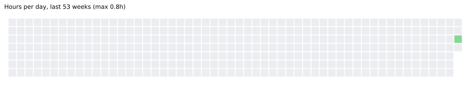
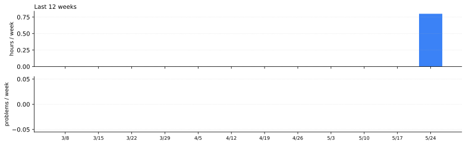

# theormin

A self-study traversal of [Landau's theoretical minimum](vault/00-meta/curriculum.md) — nine domains of classical and quantum theoretical physics, the foundation of the Soviet theoretical-physics tradition, taken seriously by one person in 2026.

Curriculum generated with Claude Opus 4.7.

The curriculum is a work in progress and shall be adjusted and adapted as time goes on. Let's see where this goes :) .

<!-- BEGIN auto:headline -->**Phase 1 · Week 1 · 0 / 8,910 problems · 1 hrs logged · started 2026-05-26**<!-- END auto:headline -->

## Where I am

<!-- BEGIN auto:status -->
| | |
|---|---|
| Active phase | Phase 1 |
| Current week | Week 1 (2026-05-27) |
| Books in progress | Tao *Analysis I*, Zorich *Mathematical Analysis vol 1*, Demidovich *Problems in Mathematical Analysis*, Strang *Introduction to Linear Algebra* |
| Last theorem reproved | — |
| Last derivation logged | — |
| Estimated baseline completion | computing… (needs ≥4 weeks of data) |
<!-- END auto:status -->

## Todo

<!-- BEGIN auto:todo -->
**This week**

- [ ] Tao Analysis I §2.1–2.3 (Peano axioms + addition + multiplication)
- [ ] Tao Ch. 2 summary
- [ ] First batch of Demidovich problems (~10)
- [ ] Strang Ch. 1–2 + MIT 18.06 Lectures 1–6
- [ ] Reprove a theorem from memory (Mon end-of-week)
- [ ] Scan paper notebook to PDF for `vault/05-derivations/week-01/`

**Soon**

- [ ] Acquire Hirsch-Smale-Devaney before Week 4–5
- [ ] Find a study partner

**Eventually**

- [ ] Pick a subfield for research-level depth (Phase 4 or later)
<!-- END auto:todo -->

Edit at [`vault/00-meta/todo.md`](vault/00-meta/todo.md). Unchecked items here, completed items stay in the source file.

## Progress

### Phases (baseline + Phase 6)

<!-- BEGIN auto:phases -->
```
Phase 1 — Mathematical foundation         ░░░░░░░░░░░░░░░░░░░░   1.7%
Phase 2 — Classical mechanics + fields    ░░░░░░░░░░░░░░░░░░░░   0.0%
Phase 3 — Quantum mechanics               ░░░░░░░░░░░░░░░░░░░░   0.0%
Phase 4 — QED + stat phys + fluids        ░░░░░░░░░░░░░░░░░░░░   0.0%
Phase 5 — Continuous media + kinetics     ░░░░░░░░░░░░░░░░░░░░   0.0%
Phase 6 — Modern QFT + GR + EFT + CMT     ░░░░░░░░░░░░░░░░░░░░   0.0%
```
<!-- END auto:phases -->

### The Nine Checkpoints

<!-- BEGIN auto:checkpoints -->
| # | Domain | Status |
|---|--------|--------|
| 1 | Math I — real analysis, ODE | 🟡 in progress |
| 2 | Math II — complex, tensor, PDE, special functions | ⬜ not started |
| 3 | Mechanics (L1) | ⬜ not started |
| 4 | Field Theory (L2) — SR, GR intro, classical E&M | ⬜ not started |
| 5 | Quantum Mechanics (L3) | ⬜ not started |
| 6 | Statistical Physics (L5) | ⬜ not started |
| 7 | Continuous Media (L6, L7) | ⬜ not started |
| 8 | Electrodynamics of Continuous Media (L8) | ⬜ not started |
| 9 | Quantum Electrodynamics (L4) | ⬜ not started |
<!-- END auto:checkpoints -->

### Subject progress (problems worked / target)

<!-- BEGIN auto:subjects -->
```
Real analysis               0 / 1,000 ░░░░░░░░░░░░░░░░░░░░
Linear algebra              0 / 350   ░░░░░░░░░░░░░░░░░░░░
ODE                         0 / 400   ░░░░░░░░░░░░░░░░░░░░
Complex analysis            0 / 150   ░░░░░░░░░░░░░░░░░░░░
Calc of variations          0 / 50    ░░░░░░░░░░░░░░░░░░░░
PDE / math methods          0 / 100   ░░░░░░░░░░░░░░░░░░░░
Functional analysis         0 / 200   ░░░░░░░░░░░░░░░░░░░░
General physics             0 / 2,300 ░░░░░░░░░░░░░░░░░░░░
Mechanics (L1)              0 / 250   ░░░░░░░░░░░░░░░░░░░░
Classical fields (L2)       0 / 250   ░░░░░░░░░░░░░░░░░░░░
Quantum mechanics (L3)      0 / 1,000 ░░░░░░░░░░░░░░░░░░░░
QED / QFT                   0 / 700   ░░░░░░░░░░░░░░░░░░░░
```
<!-- END auto:subjects -->

### Activity

<!-- BEGIN auto:heatmap -->

<!-- END auto:heatmap -->

<!-- BEGIN auto:sparklines -->

<!-- END auto:sparklines -->

## Daily log

<!-- BEGIN auto:daily_log -->
**Wed 2026-05-27 — 0h**
- 0h *sick* — Strep throat — no work, going to sleep

**Tue 2026-05-26 — 0.8h**
- 0.5h *meta* — Repo + vault infrastructure setup
- 0.3h *real_analysis* — Tao Analysis I Ch. 1 read
<!-- END auto:daily_log -->

## Recent activity

<!-- BEGIN auto:recent -->_Nothing logged yet. Activity will appear here after Week 1 entries land._<!-- END auto:recent -->

## Reading shelf

<!-- BEGIN auto:shelf -->
| Book | Status | Progress |
|------|--------|----------|
| Tao, *Analysis I* | in progress | 1 / 13 chapters |
| Zorich, *Mathematical Analysis vol 1* | in progress | 0 / 8 chapters |
| Demidovich, *Problems in Mathematical Analysis* | in progress | 0 / 10 chapters |
| Strang, *Introduction to Linear Algebra* | in progress | 0 / 11 chapters |
| Shilov, *Linear Algebra* | not started | — |
| Axler, *Linear Algebra Done Right* | not started | — |
| Arnold, *Ordinary Differential Equations* | not started | — |
| Hirsch-Smale-Devaney, *Differential Equations, Dynamical Systems, and an Introduction to Chaos* | not started | — |
| Krasnov, Kiselev, Makarenko, *Problems in ODEs* | not started | — |
| Markushevich, *Theory of Functions of a Complex Variable vol 1* | not started | — |
<!-- END auto:shelf -->

## How this repo works

- **`vault/`** — Obsidian vault. Open `vault/` (not the repo root) in Obsidian. One file per week in `01-weeks/` holds the plan, sessions table, problems table, and reflection. Chapter summaries live in `02-summaries/`, theorem reproofs in `03-theorems/`, end-of-week PDF scans in `05-derivations/`. See [`vault/README.md`](vault/README.md) for the convention.
- **`data/`** — machine-readable progress: `problems.csv`, `sessions.csv`, `theorems.csv`, `summaries.csv`, plus `books.yaml` and `config.yaml`. The CSVs are regenerated from the vault on every CI run; `books.yaml` is hand-maintained metadata (titles, prereqs) with `chapters_done` auto-derived from completed chapter summaries.
- **`scripts/`** — Python that walks the vault and rebuilds the dashboard. `extract_from_vault.py` parses the weekly tables, `gen_charts.py` renders the SVGs, `gen_readme.py` updates this file's auto-sections. Run all three via `./scripts/refresh.sh`.
- **`.github/workflows/update-dashboard.yml`** — runs the scripts on push to main and weekly.
- **`images/`** — generated charts.

## Workflow

Day-to-day: read book, take notes / work problems on paper. Open the current week's file in `vault/01-weeks/` and add a row to the `## Sessions` table (date, hours, subject, activity) and to `## Problems worked` (date, book, ref, subject, minutes, status). Write a chapter summary in `vault/02-summaries/<book>/` when a chapter is done.

End of week: reprove a theorem from memory and write it up in `vault/03-theorems/`. Scan paper to PDF, drop into `vault/05-derivations/week-XX/` with a short `index.md` listing what's inside. Fill in the `## Reflection` at the bottom of the week file. `git push` and the dashboard regenerates.

## The curriculum

Full plan with phase-by-phase book lists and problem targets: [`vault/00-meta/curriculum.md`](vault/00-meta/curriculum.md). The target is reading-level competence across the nine domains plus research-level depth in one chosen subfield. Roughly 13–18 years at ~30 hrs/week including Phase 6 (modern QFT/GR/EFT/CMT).

## License

Notes, summaries, derivations: [CC BY 4.0](LICENSE-notes). Code: [MIT](LICENSE-code).

---

_Started 2026-05-26. Last dashboard refresh: <!-- BEGIN auto:timestamp -->2026-05-27<!-- END auto:timestamp -->._
